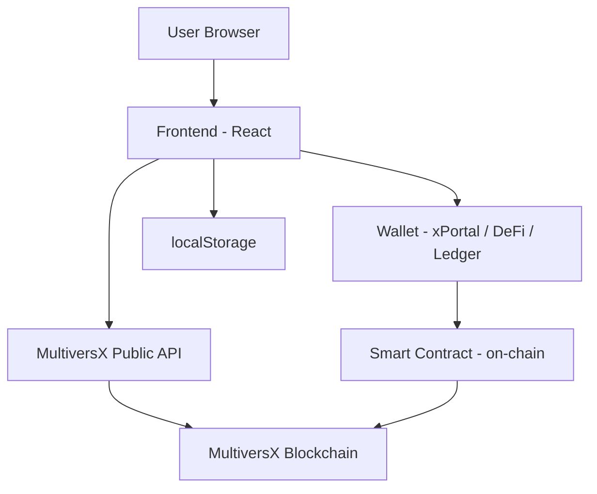

# Architecture Overview

## Project Structure

```
multiversx-multisig-platform/
├── contract/              # Rust smart contract (MultiversX SC)
│   ├── src/
│   │   ├── lib.rs                 # Main contract trait
│   │   ├── action.rs              # Action enum (EGLD, board, SC deploy)
│   │   ├── multisig_propose.rs    # Propose endpoints
│   │   ├── multisig_perform.rs    # Execute endpoints
│   │   ├── multisig_state.rs      # Storage mappers
│   │   ├── multisig_events.rs     # Event logging
│   │   └── user_role.rs           # Role enum (None, Proposer, BoardMember)
│   ├── output/                    # Compiled WASM + ABI
│   └── meta/                      # Build tooling
├── frontend/              # React + Vite + TypeScript
│   ├── src/
│   │   ├── pages/                 # 13 page components
│   │   ├── components/            # Layout, UI, shared components
│   │   ├── hooks/                 # Custom React hooks
│   │   ├── utils/                 # Utilities (formatters, export, etc.)
│   │   ├── config/                # Network configuration
│   │   └── contracts/             # SC interaction layer
│   └── index.html
├── scripts/               # Deploy scripts
│   └── deploy-devnet.mjs
├── docs/                  # Documentation (this folder)
└── README.md
```

## Technology Stack

| Layer | Technology | Purpose |
|---|---|---|
| **Smart Contract** | Rust + `multiversx-sc` | On-chain multisig logic |
| **Frontend** | React 18 + TypeScript | User interface |
| **Build Tool** | Vite 5 | Dev server + bundling |
| **Styling** | Tailwind CSS + custom CSS | Dark theme, animations |
| **Animations** | Framer Motion | Page transitions, modals |
| **Wallet** | `@multiversx/sdk-dapp` | Wallet connection (xPortal, DeFi, Ledger) |
| **Notifications** | `react-hot-toast` | Toast notifications |
| **Routing** | React Router v6 | SPA navigation |
| **State** | localStorage + React hooks | Client-side persistence |

## Data Flow



### Key Interactions

1. **Read operations** → Frontend queries MultiversX API (no wallet needed)
2. **Write operations** → Frontend builds TX → Wallet signs → Broadcast to chain
3. **Local data** → Contacts, settings, preferences saved in localStorage
4. **Smart contract** → Holds funds, manages board, executes proposals

## Page Architecture

| Page | Route | Data Source |
|---|---|---|
| Unlock | `/unlock` | Wallet SDK |
| Dashboard | `/` | API + localStorage |
| Create Multisig | `/create` | Smart contract |
| Multisig Detail | `/multisig/:address` | API + Smart contract |
| History | `/history` | MultiversX API |
| Address Book | `/address-book` | localStorage |
| Analytics | `/analytics` | API (computed) |
| Staking | `/staking` | MultiversX API |
| Settings | `/settings` | localStorage |
| Multi-Chain | `/multi-chain` | Static + localStorage |
| Governance | `/governance` | localStorage |
| Plugins | `/plugins` | localStorage |
| 2FA | `/two-fa` | localStorage |
| Social Recovery | `/social-recovery` | localStorage |

## Security Model

- **No backend server** — eliminates server-side attack vectors
- **Wallet-based auth** — no passwords, no sessions
- **On-chain logic** — multisig validation happens in the smart contract
- **Client-side data** — localStorage only stores non-sensitive preferences
- **PEM files** — never committed to version control (`.gitignore`)
